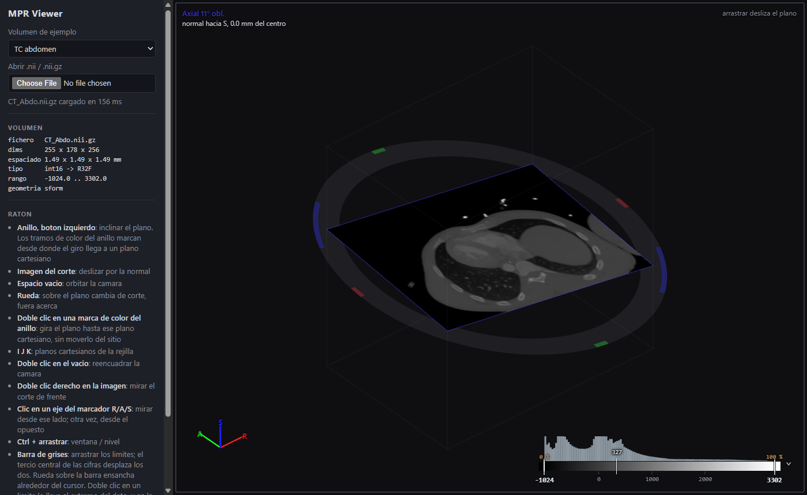

# MPR Viewer

Visor de **reconstruccion multiplanar (MPR)** para volumenes medicos NIfTI que
funciona en el navegador. Muestra el volumen en una sola vista 3D con un plano
de corte que se manipula directamente en el espacio: se inclina con un anillo,
se desliza por su normal y se lleva a cualquier orientacion, incluidas las
oblicuas. La imagen del corte se calcula en la GPU, asi que un plano oblicuo
cuesta lo mismo que uno axial.



**Lo que ofrece:**

- corte oblicuo arbitrario con interpolacion trilineal en la GPU;
- un manipulador 3D (el anillo) para inclinar y deslizar el plano, que indica
  desde donde se llega a cada plano cartesiano y deja el plano sobre ellos con
  un leve iman;
- una barra de grises interactiva con histograma: ventana / nivel, deformacion
  de la rampa, colores de saturacion e iman de percentiles;
- lineas de nivel (isolineas) sobre el corte, en vivo o fijadas;
- tres volumenes de ejemplo incluidos, y carga de ficheros propios `.nii` y
  `.nii.gz`.

Es un prototipo: no esta pensado para uso clinico ni diagnostico.

---

## Instalacion

### Requisitos

| Que | Version | Para que |
| --- | --- | --- |
| [Node.js](https://nodejs.org/) | 20.19 o posterior, o 22.12 o posterior | Instalar dependencias y ejecutar el servidor de desarrollo |
| npm | el que trae Node.js | Gestor de paquetes |
| Navegador con WebGL2 | Chrome, Edge o Firefox recientes | Ver la aplicacion |

Para comprobar la version de Node.js:

```
node -v
```

El navegador necesita la **aceleracion por hardware activada**: sin ella no hay
WebGL2 y la app muestra un aviso en lugar de la imagen.

### Pasos

1. Clona el repositorio. Es privado: necesitas que su propietario te invite
   como colaborador en GitHub.

   ```
   git clone https://github.com/ezacur/MultiPlaneReconstruction.git
   cd MultiPlaneReconstruction
   ```

   Tambien sirve una copia descomprimida del proyecto, si te la han pasado
   asi.

2. Instala las dependencias (solo la primera vez, o cuando cambie
   `package.json`):

   ```
   npm install
   ```

No hace falta nada mas: los volumenes de ejemplo vienen dentro del proyecto, en
`public/data` (unos 13 MB).

---

## Ejecucion

### En local, para usarlo o desarrollar

```
npm run dev
```

La terminal muestra una direccion, normalmente `http://localhost:5173/`.
Abrela en el navegador: la aplicacion arranca con el TC de abdomen de ejemplo ya
cargado. Mientras el servidor este en marcha, cualquier cambio en `src/` se
recarga solo en la pagina. Para pararlo, `Ctrl+C` en la terminal.

Si el puerto 5173 esta ocupado, Vite elige el siguiente libre y lo indica. Para
fijar uno concreto:

```
npm run dev -- --port 5180
```

### Version de produccion

```
npm run build
npm run preview
```

- `npm run build` comprueba los tipos con TypeScript y genera la aplicacion
  compilada en la carpeta `dist/`.
- `npm run preview` sirve esa carpeta en `http://localhost:4173/` para probarla
  tal como quedaria publicada.

### Publicarla en un servidor

`dist/` es un sitio **estatico**: basta copiar su contenido a cualquier servidor
web (nginx, Apache, GitHub Pages, un bucket S3...). No hace falta backend.

- **No funciona abriendo `dist/index.html` con doble clic.** El navegador no
  deja descargar los volumenes desde `file://`; tiene que servirse por HTTP.
- **Si se publica en una subruta** (por ejemplo `https://servidor/mpr/` en
  lugar de la raiz del dominio), hay que indicarla al compilar:

  ```
  npx vite build --base=/mpr/
  ```

  y abrirla con la barra final (`/mpr/`, no `/mpr`). En Git Bash de Windows,
  antepon `MSYS_NO_PATHCONV=1` al comando, porque si no Git Bash convierte
  `/mpr/` en una ruta de Windows.

---

## Uso

La pantalla tiene dos partes: el **panel lateral**, a la izquierda, con el
selector de volumen, los datos del volumen cargado y un resumen de los gestos;
y la **vista 3D**, con el plano de corte, su anillo, la caja del volumen, el
marcador de ejes R/A/S abajo a la izquierda y la barra de grises abajo a la
derecha.

Casi todo se hace con el raton. La regla general es espacial: sobre el plano o
el anillo, el raton actua sobre el plano; sobre el vacio, sobre la camara.

### Cargar un volumen

- **Ejemplos:** el selector *Volumen de ejemplo* del panel.
- **Fichero propio:** el boton *Abrir .nii / .nii.gz*, o arrastrar el fichero
  sobre la vista.

Acepta NIfTI-1 sin comprimir (`.nii`) o comprimido con gzip (`.nii.gz`), con
datos enteros de 8, 16 o 32 bits (con y sin signo) o en coma flotante de 32 o
64 bits. Se aplican `scl_slope` y `scl_inter`, y la geometria sale de la
`sform` o la `qform` del fichero. De un fichero 4D se carga el primer volumen.

### Mover el plano

El plano lleva un **anillo** concentrico. El anillo y la caja del volumen solo
se muestran cuando hacen falta: aparecen al pasar el raton por la imagen y se
desvanecen al salir, para que en reposo el corte se vea limpio.

| Accion | Como |
| --- | --- |
| Inclinar el plano | Arrastrar el **anillo** con el boton izquierdo |
| Deslizar el plano por su normal | Arrastrar desde la **imagen** del corte |
| Cambiar de corte | **Rueda** sobre el plano (con Shift, de 5 en 5) |
| Cancelar el arrastre en curso | **Esc** |

Al inclinar se dibujan el **eje** de giro, un **rayo** del eje al puntero y el
**arco** que recorrera el punto agarrado; el eje y el rayo aparecen ya al pasar
por el anillo, antes de arrastrar. Si el giro se acerca a un plano cartesiano
de la rejilla del volumen, el plano se asienta exactamente sobre el gracias a un
iman de 2.5 grados. El plano nunca se sale del volumen: si al girar quedaria
fuera, se mantiene dentro, junto a la cara mas cercana.

### Ir a un plano cartesiano

Los planos cartesianos son los de la rejilla de adquisicion del volumen, con
normal en los ejes I, J o K del array. El de normal K es el plano de
adquisicion, que es el que se muestra al cargar.

| Accion | Como |
| --- | --- |
| Girar hasta un plano cartesiano | **Doble clic** en una **marca de color** del anillo |
| Ir al plano de normal I, J o K por el centro del volumen | Teclas **I**, **J**, **K** |

Las **marcas de color** del borde del anillo indican desde donde se puede coger
para que el giro llegue a un plano cartesiano: rojo para el de normal I, verde
para J y azul para K. Al pasar el raton por una, se resalta con su borde y la
pista de la esquina superior derecha dice a que plano lleva. Durante el giro,
una **esfera hueca** sobre el arco marca el punto exacto de llegada.

El **borde de la imagen** toma el color de la normal del plano (rojo, verde o
azul segun el eje dominante) y se engruesa cuando el plano esta exactamente
sobre una cartesiana.

### Mover la camara

| Accion | Como |
| --- | --- |
| Orbitar | Arrastrar en el **vacio** |
| Acercar o alejar | **Rueda** fuera del plano |
| Mirar a lo largo de un eje del paciente | **Clic** en la letra **R**, **A** o **S** del marcador de ejes; otro clic, desde el lado opuesto |
| Mirar el corte de frente | **Doble clic derecho** sobre la imagen |
| Volver al encuadre inicial | **Doble clic** en el vacio |

Las coordenadas son las del paciente en convencion RAS: R derecha, A anterior,
S superior. El marcador de la esquina sigue a la camara.

### Ventana / nivel: la barra de grises

La barra de la esquina inferior derecha es la funcion de transferencia: negro
por debajo del limite inferior, la rampa entre los dos limites y blanco por
encima del superior. Encima lleva el histograma del volumen, que dice donde
esta el dato; debajo, la escala, con los dos limites como cajas editables. Al
cargar un volumen la ventana abarca todo el rango del dato.

| Accion | Como |
| --- | --- |
| Mover un limite | Arrastrar su linea sobre la barra |
| Ajuste fino | Mantener **Alt** mientras se arrastra |
| Seguir mas alla del extremo | Sacar el limite por un extremo: sigue avanzando solo |
| Desplazar la ventana sin cambiar su ancho | Arrastrar el tercio central de la fila de cifras |
| Ensanchar o estrechar la ventana | **Rueda** sobre la barra, alrededor del cursor |
| Ajustarla desde la vista | **Ctrl + arrastrar** en la vista, o boton central fuera del plano |
| Llevar un limite al extremo del dato | **Doble clic** en su linea |
| Escribir un limite | Clic en su caja, teclear el valor y Enter |
| Pegar un limite a un percentil | Mantener **Ctrl** al arrastrar: aparecen las paradas 0, 2, 5, 10, 25, 50, 75, 90, 95, 98 y 100 |
| Color para lo que queda fuera de la ventana | **Clic derecho** en una cola saturada o en su linea |
| Plegar o desplegar el histograma | El boton ˅ / ˄ junto al extremo derecho |

Junto a cada limite se indica el percentil del dato que deja por debajo, o
`◀ out` / `out ▶` si se ha salido del rango del dato.

**Deformar la rampa:** un doble clic sobre la barra pone un nodo en la curva de
grises; arrastrarlo deforma la rampa, y el corte cambia con ella. Dos clics
derechos seguidos sobre un nodo lo borran, y Ctrl + doble clic sobre la barra
vuelve a la rampa lineal. Caben hasta ocho nodos.

### Lineas de nivel

El raton siempre senala un valor: sobre la barra, el de esa posicion; sobre el
corte, el valor bajo el cursor. La aguja de la barra lo marca.

| Accion | Como |
| --- | --- |
| Ver la linea de nivel de ese valor sobre el corte | Mantener **Shift** sobre la barra o sobre la imagen |
| Fijarla | **Shift + clic**, en la barra o en la imagen |
| Resaltar una fijada | Pasar el raton por su marca en la barra |
| Borrar una fijada | **Clic derecho** en su marca |

Caben ocho lineas fijadas. Pertenecen al volumen en que se leyeron: al cargar
otro, desaparecen.

### Teclado

| Tecla | Accion |
| --- | --- |
| **I**, **J**, **K** | Plano cartesiano de normal I, J o K |
| **Esc** | Deshacer el arrastre en curso |
| **Shift** | Lineas de nivel (con el raton) |
| **Ctrl** | Ventana / nivel desde la vista, e iman de percentiles en la barra |
| **Alt** | Ajuste fino en la barra |

---

## Volumenes de ejemplo

En `public/data`, procedentes de
[niivue/niivue-demo-images](https://github.com/niivue/niivue-demo-images),
con licencia BSD-2-Clause (ver `public/data/LICENSE`).

| Fichero | Que es |
| --- | --- |
| `CT_Abdo.nii.gz` | TC de abdomen, isotropico. Es el que se carga al arrancar. |
| `CT_pitch.nii.gz` | TC de craneo adquirido con el gantry inclinado unos 16 grados: el plano de adquisicion no coincide con el axial del paciente, el caso que mejor muestra para que sirve el MPR. |
| `mni152.nii.gz` | Plantilla de RM cerebral MNI152. |

Para ver las dimensiones, el espaciado y la affine de un fichero sin abrir la
aplicacion:

```
node tools/niftiinfo.mjs ruta/al/fichero.nii.gz
```

---

## Si algo falla

| Sintoma | Causa probable y solucion |
| --- | --- |
| "Este navegador no soporta WebGL2" | Aceleracion por hardware desactivada o navegador antiguo. Activala en la configuracion del navegador o usa uno reciente. |
| "No se pudo subir el volumen a la GPU" | El volumen supera el tamano maximo de textura 3D de la GPU. El volumen que estaba cargado sigue en pantalla. |
| `npm install` o `npm run dev` se quejan de la version de Node | Node anterior a 20.19. Actualiza Node.js. |
| La pagina compilada sale en blanco | Se ha abierto `dist/index.html` desde el disco. Sirvela por HTTP, por ejemplo con `npm run preview`. |
| Publicada en una subruta, no carga | Falta `--base` al compilar, o se ha abierto sin la barra final. Ver *Publicarla en un servidor*. |
| El puerto 5173 esta ocupado | Vite usa el siguiente libre y lo indica en la terminal; o fija otro con `npm run dev -- --port 5180`. |

---

## Estructura del proyecto

| Ruta | Contenido |
| --- | --- |
| `index.html` | La pagina: panel lateral y vista. |
| `src/main.ts` | Arranque, carga de ficheros, panel y bucle de dibujo. |
| `src/nifti.ts` | Lectura de NIfTI: cabecera, datos, escalado y affine voxel a mundo. |
| `src/scene.ts` | El estado: el plano, la camara, los planos cartesianos, las transiciones animadas y la geometria de seleccion. |
| `src/widget.ts` | El manipulador: anillo, marcas, eje, arco, guias y el ciclo de arrastre. |
| `src/renderer.ts` | WebGL2: textura 3D, shader de corte con lineas de nivel, y dibujo de lineas y cintas. |
| `src/interact.ts` | Raton, rueda y teclado de la vista. |
| `src/colorbar.ts` | La barra de grises: histograma, limites, rampa, percentiles y lineas de nivel. |
| `src/quantise.ts` | El iman de la normal hacia los ejes de la rejilla. |
| `src/style.css` | Estilos. |
| `public/data/` | Volumenes de ejemplo. |
| `tools/niftiinfo.mjs` | Inspeccion de ficheros NIfTI desde la linea de comandos. |
| `tools/quantise-lab.html` | Banco de pruebas autonomo del iman (se abre directamente en el navegador). |
| `docs/DISENO.md` | Notas de diseno: como funciona cada pieza y por que. |

Esta hecho en **TypeScript** sin framework de interfaz, con **Vite** para el
desarrollo y el empaquetado, **WebGL2** para el dibujo, y dos dependencias:
[`gl-matrix`](https://glmatrix.net/) para el algebra y
[`nifti-reader-js`](https://github.com/rii-mango/NIFTI-Reader-JS) para leer los
ficheros.

Para entender o modificar el codigo, empieza por
[`docs/DISENO.md`](docs/DISENO.md).

---

## Licencia

Los volumenes de ejemplo tienen licencia BSD-2-Clause (ver
`public/data/LICENSE`). El repositorio todavia no incluye una licencia para el
codigo.
